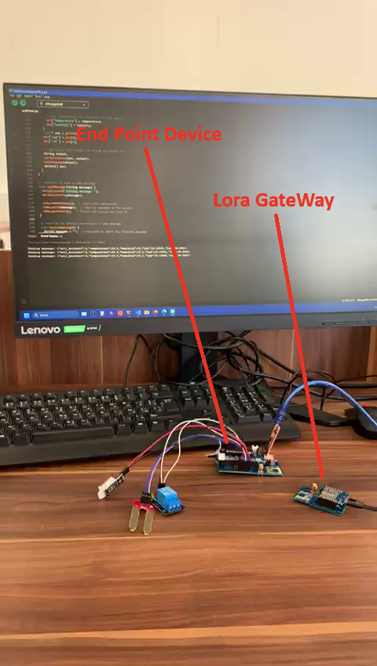
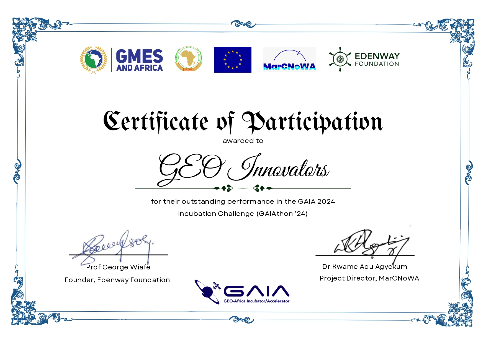

# Smart Irrigation System - GAIAthon'24 Project 🌱

## Project Overview
This Smart Irrigation System was developed during GAIAthon'24, a hackathon organized by CERT in partnership with SUPCOM as part of the MarcNoWA research project. Our solution combines IoT technology with satellite imagery to create an intelligent irrigation management system that optimizes water usage in agriculture.

## Problem Statement
Water scarcity is a critical global issue, particularly affecting agriculture which consumes approximately 70% of freshwater resources. Traditional irrigation practices often lead to:

- Reduced crop yields
- Environmental impact through water waste
- Challenges in irrigation timing and quantity

## Our Solution
We developed a Smart Irrigation System that leverages:
- Real-time IoT sensor data
- Weather forecast integration

## Technologies Used

### Hardware Components
- Soil Moisture Sensors
- Air Temperature Sensors
- Air Humidity Sensors
- LoRa Gateway



### Software & APIs
- MySQL Database
- MQTT Protocol
- Open-Meteo API for weather forecasts
- ArcGIS for geographic analysis

### Satellite Data
- Copernicus Earth Observation data
- ArcGIS satellite imagery

### Communication Protocols
- LoRa for long-range sensor communication
- MQTT for cloud data transmission

## Key Features
- Real-time environmental monitoring
- Satellite data integration
- Automated irrigation scheduling
- Weather-driven optimization
- Long-range, low-power communication
- Historical data analysis

## System Architecture

```
Sensors -> LoRa Gateway -> Cloud Platform -> Decision Algorithm -> Irrigation Control
   ↑                            ↑
Satellite Data             Weather API
```

## Results & Impact
Our system demonstrates:
- Reduced water consumption
- Improved crop health
- Automated decision-making
- Integration of multiple data sources


## Team
Project developed during GAIAthon'24 by Geo Innovators from SUPCOM

## Awards
- Second place winner of GAIAthon'24
- Presented at GAIAfest on October 9, 2024

